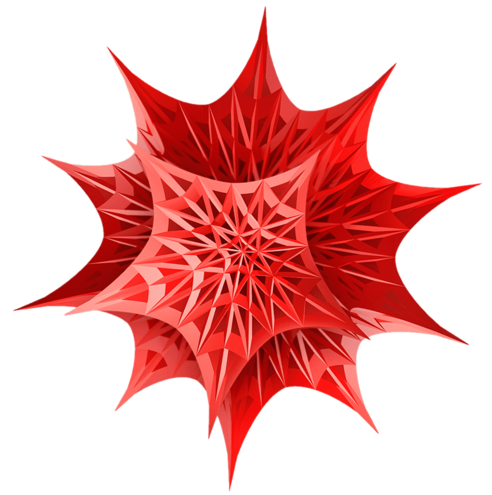
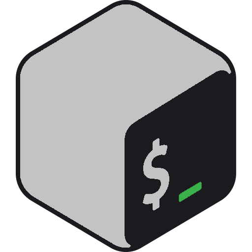
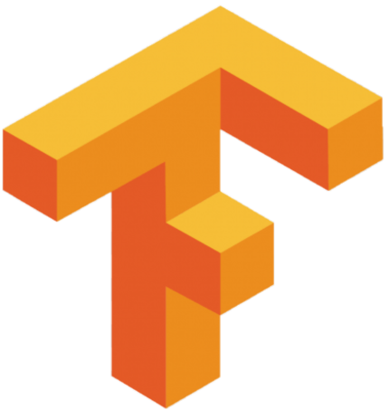
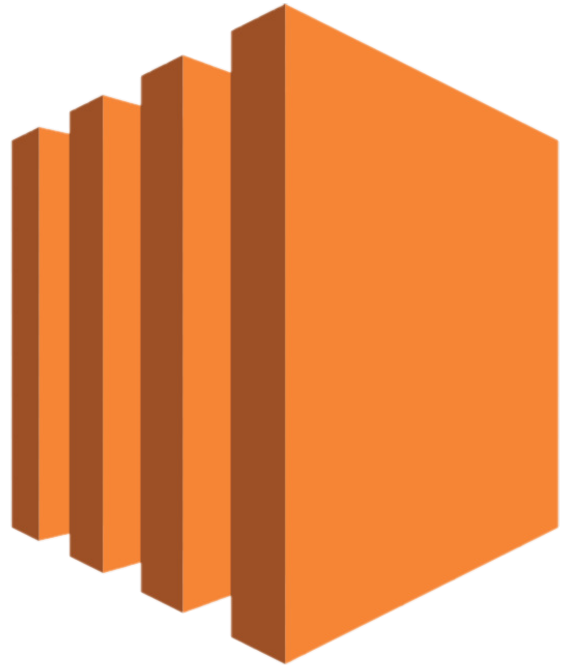

<!-- Greeting -->
# Cheers!

<!--Introduction -->
All things engineering at the University of Florida! :crocodile::crocodile:

| Sr. Avionics & Software Engineer at Piper Aircraft 
| PhD Student Cybernetics & AI @ University of Florida, ECE 
| M.S. Electrical & Computer Engineering @ University of Florida, ECE 
| B.S. Civil & Coastal Engineering @ University of Florida, CCE 
| Naval Engineering @ Virginia Tech, AOE 
| Russian Language Certification @ Moscow State University 
| Machine Learning (ECE) Certified @ University of Florida

 

 <!-- GitHub README Stats -->
  <a href="https://github.com/mgwein?tab=repositories">
    
   <!-- 

<!-- Your badges -->

### Programming Languages

|||
|---|---|---|---|

|||
|---|---|---|---|

||
|---|---|

### Tools

|||
|---|---|---|---|

|||
|---|---|---|---|

||||
|---|---|---|---|

|||
|---|---|---|---|

|||
|---|---|---|---|

|||
|---|---|---|---|

||||
|---|---|---|---|

<!--  -->

<!-- Profile View Count -->

### Contact

              

